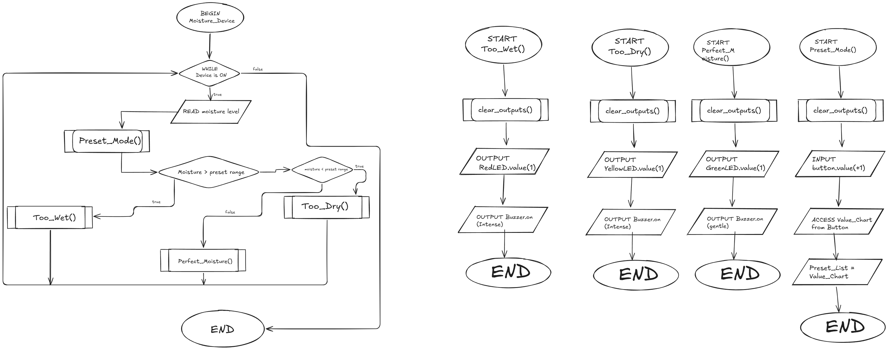

# Pradhyot-9CT-Task-2
term 3 mechatronics assesment  
A moisture dectector machine

## Requirement Outline
### The Problem: 
how do you know if something has properly dried or perhaps if a plant is within its correct moisture level?

### The Solution: 
The moisture detection device (MDD) will use its sensors to detect the moisture level within an item or an area, there would be LEDs on the device to show the level based on the mode that the person selects, for example: drying mode - will light up green when the object is almost void of moisture within the item, or plant mode - will light up green if a plant has the correct moisture level based on several plant presets and red if it is out of that range

### Functions of the Device: 
* has several modes able to be cycled through via a button
* based on the mode selected an LED array will light to indicate the correct level 
* user could input a custom moisture level based on the potentiometer 

### Functional Requirements
* **Moisture Sensor** - detects the moisture level within an object and outputs a response within the provided value range
* **LED Output** - an LED board that will light green if the amount is within the provided range, yellow if the value is 5kPa away from the range and red if it is futher than 5kPa

### Non-functional Requirements
* **response time** - a response should be given within about 3 seconds as the device would take a little time to analyze the whole amount of data
* **efficiency** - have concise and purposeful code within the pico 
* **accuracy** - the readings should be within 5kPa so that the readings are accurate  

### Test Cases
| Test Case | Input     | Expected Output   |
|---------- |---------- |----------------   |
|object too dry| moisture sensor reads a value above the provided value|light an LED and a small, harsh buzzer humm to signify the object is too dry |
|Object too wet|moisture sensor reads a value below the provided value|light an LED and a small buzzer but harsh humm to signify the object is too wet|
|object within the correct moisture|moisture sensor detects a value within the provided range|light an LED accompanied with a gentle buzzer humm.|
|Device changes measuring type|With a button press the device will change presets to another value range|A small LED changes color to signify the mode and the presets within the device would change| 
|User makes a custom value|using a potentiometer the user could manually create a value range for the device to use| the device temporarily stores the value and uses it to provide a reading| 

## Algorithms 
### Flowchart
 

### Pseudocode 
pseudocode()  
BEGIN PerfectM()  
    clear_outputs()  
    OUTPUT green_led.value(1)  
    OUTPUT buzzer.on()  
END PerfectM()  

BEGIN too_dry()  
    clear_outputs()  
    OUTPUT yellow_Led.value(1)  
    OUTPUT buzzer.on()  
END too_dry  

BEGIN too_wet()  
    clear_outputs()  
    OUTPUT red_Led.value(1)  
    OUTPUT buzzer.on()  
END too_wet  

BEGIN Preset_Mode()  
    clear_outputs()  
    INPUT Button.value(+1)  
    Preset_List[] (navigate through list with button)  
    Preset_Value = Preset_List[chosen value]  
END Preset_Mode()  

BEGIN  
    WHILE Device is on   
       READ moisture level  
       Preset_Mode()  
       IF Mosture > Preset_Value  
            THEN too_wet()  
       END IF  
       IF Moisture < Preset_Value  
            THEN too_dry()  
            ELSE PerfectM()  
       END IF  
    ENDWHILE  
END

